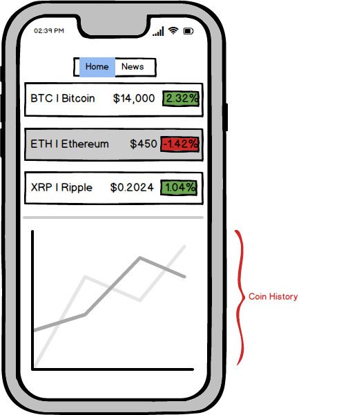

# Cryptos
by Jay Schwartz, Miles McLeod, and Henry Chen

## Background and Overview
Cryptos is an app that allows users to view the top 30 coins traded on that day with detailed information along with the last 24 hours of pricing data. There is also an interactive chart that visualizes the last 24 hours of data. In addition, users also have the ability to see and search the current crypto currency news.

## Functionality & MVP
- [ ] View Cryptocurrency Coin Prices for a single exchange
  * API - Bittrex
- [ ] Graph of coin pricing using ChartJS
- [ ] View coin specific news
- [ ] Search News
- [ ] Demo Emulator & Site (splash page)

## Bonus Features
- [ ] Buy/Sell coins
- [ ] Utilize CoinBase Auth
- [ ] Get data from multiple exchanges (API’s)
- [ ] Utilize iPhone accelerometer for large graph when sideways
- [ ] Favorite Coins (with user sign-in)
- [ ] Historical data storage generation
- [ ] Include exchange Index Tracking

## Technologies & Technical Challenges
#### Backend
* MongoDB, ExpressJS, NodeJS, Mongoose.JS
* The backend will make periodic requests to the Bittrex API and then store coin and exchange data in the database. API requests from our frontend will hit an action in our backend that sends coin data from our database, and not from the foreign API.
  * The data will be served to the frontend in JSON format via Express.

#### Frontend
* ReactNative for App, ChartJS for graphs, HTML/CSS/JS for browser demo/splash page
* The frontend will implement calls to the backend API for current cryptocurrency data and allows users to swipe to change between list of coins & news search
* Selected coin to show coin specific info on the bottom & swipe to navigate between:
  * News
  * Data
  * Graph
* Touch pricing to change between
  * % change
  * $ change
  * Bitcoin change (Last 24 hours)

#### Refining API Data

#### Accessing exchange data
* Bittrex has a publicly available dataset of current pricing of multiple coins.  We plan to extract the current price and calculate the change over the last 24 hours (non-rolling)
* Coinbase has a publicly available dataset of three coins.  Since all of the other coins are traded using one of those three and are priced in Bitcoin, we will use the current Bitcoin to USD from Coinbase API to calculate the current price of all other coins in both Bitcoin and USD.

* The data we receive from Bittrex & Coinbase will also be stored in our database to allow for historical data generation and create graphs further back as we generate the data.

## Accomplished over the Weekend
- [ ] Learn the basics of the MERN stack build a simple CRUD backend using MongoDB, Express, and NodeJS.
- [ ] Begin setting up backend AJAX requests to Bittrex API and draw a sample database structure
- [x] Test our API endpoints with AJAX requests from the console
- [x] Learn React Native and build the ‘Home’, ‘News’, and 'Wallet' tab with dummy data
- [x] Acquired a Route53 domain name (cryptosapp.io) and hosted on CloudFront with https certificate
- [x] Built out the News component with Search function
- [x] Built detailed view of coin info under home screen

## Group Members & Work Breakdown

### Implementation Timeline

#### Day 1:
* Have the project file structure setup and get the branches setup as well - **Team**
* Be able to fetch API pricing data and store in our DB so that the information can be accessed by frontend with only one API request to the external site - **Miles(BE)/Jay(FE)**
* Open up news articles within our app - **Henry**
* Render on frontend React component for the ‘Home’ and ‘News’ tab - **Jay**

#### Day 2:
* Polish up the UI for pricing data and also build out the mini-details overview and placeholder for charts - **Jay**
* Determine if charting capabilities is possible and if we are still on schedule - **Team**

#### Day 3:
* Get a working live demo of the app on the xCode simulator - **Team**

#### Day 4:
* Testing App on iPhone for performance and bugs - **Henry**
* Styling consistency and cleanup of components - **Jay/Henry**

#### Day 5:
* Start Production README and add relevant information along with existing wireframes - **Team**

#### Day 6:
* Finish Production README and start Demo site design - **Team**

#### Day 7:
* Finish Demo site with active phone simulators and descriptions - **Team**
* Research getting our app onto the App Store - **Team**

## Wireframes

## Plan for getting users and reviews

* The team will ask friends and family to test out the app from the AppStore / Google Apps. Each member will share with at least 20 friends and family and ask for good reviews.
* We will also create a demo website page that illustrates the app Functionality and asks for feedback
